<a href="https://www.rowboatlabs.com/" target="_blank" rel="noopener noreferrer">
  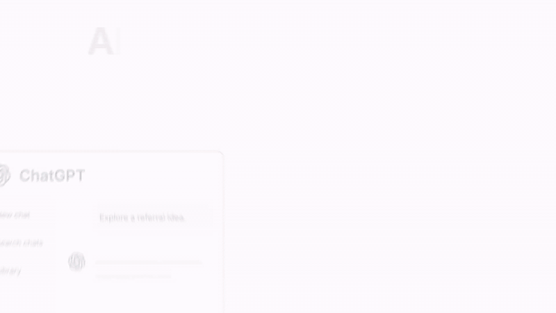
</a>

<h5 align="center">

<h1 align="center">Rowboat</h1>
<p align="center"><b>AI coworker with memory and collaboration</b></p>

<p align="center" style="display: flex; justify-content: center; gap: 20px; align-items: center;">
  <a href="https://trendshift.io/repositories/13609" target="blank">
    
  </a>
</p>

<p align="center">
    <a href="https://www.rowboatlabs.com/" target="_blank" rel="noopener">
    
  </a>
  <a href="https://discord.gg/wajrgmJQ6b" target="_blank" rel="noopener">
    
  </a>
  <a href="https://x.com/intent/user?screen_name=rowboatlabshq" target="_blank" rel="noopener">
    
  </a>
  <a href="https://www.ycombinator.com" target="_blank" rel="noopener">
    
  </a>
</p>

<p align="center">
  <a href="docs/readme/README.zh-CN.md">简体中文</a> · <a href="docs/readme/README.ja.md">日本語</a> · <a href="docs/readme/README.ko.md">한국어</a> · <a href="docs/readme/README.es.md">Español</a> · <a href="docs/readme/README.fr.md">Français</a> · <a href="docs/readme/README.pt.md">Português</a>
</p>

</h5>

AI work is still single-player: one person, one chat window, context pasted in by hand. Rowboat makes it multiplayer.

Everyone on the team runs their own Rowboat on their own machine, with their own memory of their work (email, meetings, notes, code) and their own model keys. A **Space** is the one thing you share: a place to talk, keep files and whiteboards, and get work done. Type `@rowboat` in a Space and *your* Rowboat picks it up, works with *your* context on *your* machine, and brings the result back to the room as you.

Great on your own. Even better together.

**Download for Mac, Windows and Linux:** [rowboatlabs.com/downloads](https://www.rowboatlabs.com/downloads)

⭐ If you find Rowboat useful, please star the repo. It helps more people find it.

---

## Spaces: the multiplayer part

<table>
<tr>
<td width="40%" valign="middle">
<h3>One Space. All your people. And their assistants.</h3>
A Space is a channel plus a shared folder. Messages, threads, DMs, reactions, polls, scheduled messages, and <code>@mentions</code> on one side; markdown files rendered as a wiki, uploads, and whiteboards on the other. Conversations, ideas, knowledge and the work itself, finally in the same place.
</td>
<td width="60%">
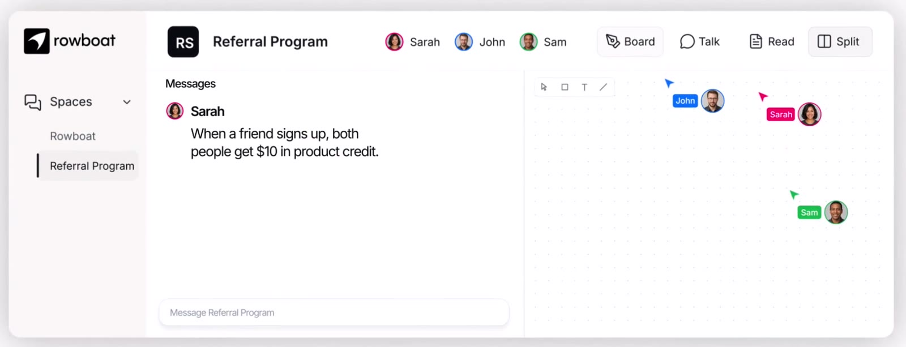
</td>
</tr>
<tr>
<td width="40%" valign="middle">
<h3>Ask your own Rowboat</h3>
<code>@rowboat what is missing?</code> wakes <b>your</b> Rowboat on <b>your</b> machine. It gathers context from your Brain, email, meetings and notes, none of which ever leave your computer, and posts the answer back to the Space as "You (via Rowboat)". Every teammate gets the same: their own agent, their own context, one shared room.
</td>
<td width="60%">
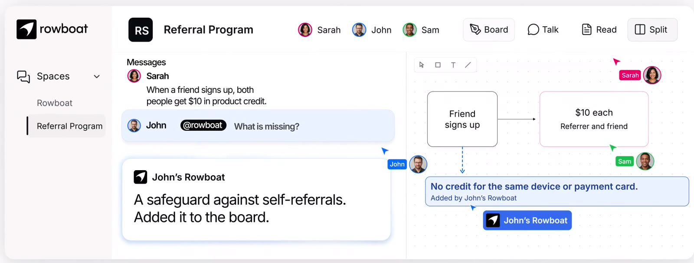
</td>
</tr>
<tr>
<td width="40%" valign="middle">
<h3>Make something together</h3>
Draw on a shared whiteboard with live cursors. Write docs as markdown with full history, diffs and restore. Open decks and documents in place. Agents use the very same files: an agent's edit lands on everyone's canvas within one event round-trip, and concurrent edits merge line by line instead of overwriting each other.
</td>
<td width="60%">
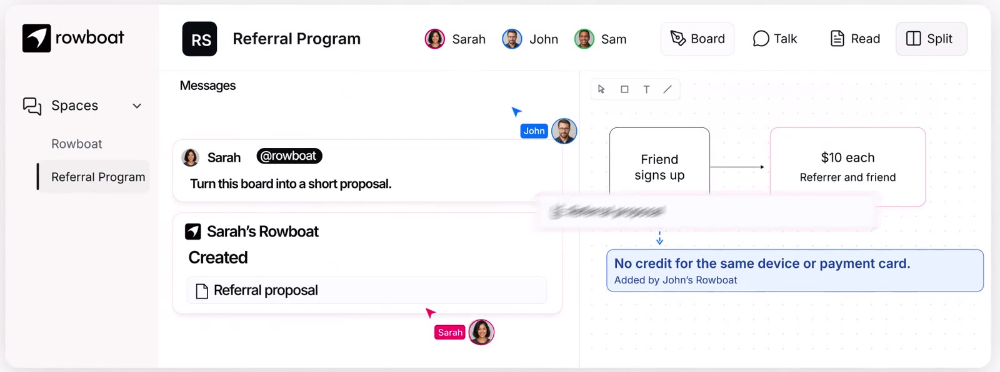
</td>
</tr>
<tr>
<td width="40%" valign="middle">
<h3>From review to result</h3>
<code>@rowboat implement the proposal</code> hands the work to Claude Code or Codex on that teammate's machine, with the Space's files as context. The changes come back to the thread ready for review.
</td>
<td width="60%">
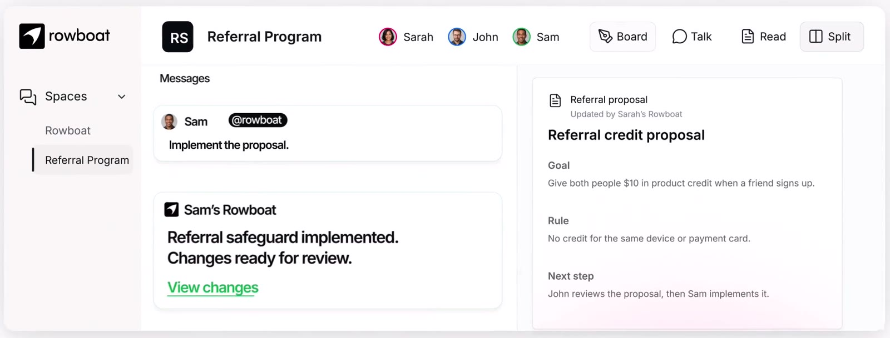
</td>
</tr>
</table>

### How it fits together

Each person's Rowboat is a full local assistant. The Space lives on a small server called **Harbor**. The only thing that crosses the line between the two is what you (or your agent, acting as you) chose to post.

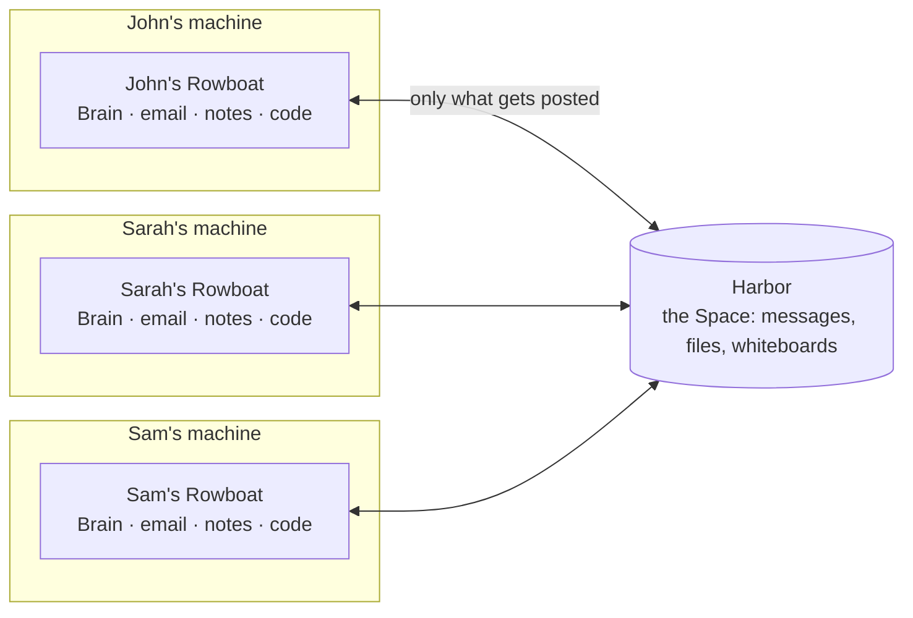

Harbor has one core and three doors: HTTP, a live WebSocket, and an MCP server. Rowboat's own agent gets **no privileged path**. It reaches the Space through the same MCP door any other agent would use, so anything Rowboat can do in a Space, your own agent can do too (see [Bring any agent](#bring-any-agent-to-a-space)).

### What the room sees

When you address your Rowboat in a thread, the whole room saw the ask, so the receipt is a reaction on your message, not a stream of chatter:

| Reaction | Meaning |
|---|---|
| 👀 | Your Rowboat picked it up and is working. The room also sees a live "Rowboat is working" chip. |
| ✅ | Done. When the outcome speaks for itself (a file edited, a thread titled, a message pinned), that is all you get. A reply is posted only when the ask wanted an answer. |
| ❗ | It needs you: a decision, a confirmation, or something it could only explain with private detail. It asks in your own chat, which only you can see, never in the room. |

Everything an agent writes is attributed to its person, "Name (via Rowboat)", and stays in history like any other message.

### Privacy rules your Rowboat follows in a Space

Everything it posts lands in front of the team. Everything it reads might be private to you. So:

- **Read only what the task needs.** "Message Harsh" needs a member id, not the HR directory.
- **Answer only what was asked.** What it saw in your files, DMs, email or notes along the way does not go into the reply.
- **Private crosses to shared only on request, and as a summary.** "Add my meeting notes to the roadmap" writes what the room needs from them, never the notes themselves. It never pastes emails, chats or DM content into a Space.
- **A receipt says what it did, not what it read.**

### Get a Space

- **Create a server.** In the app, open Spaces and choose *Create a server*. Sign in with your Rowboat account (Google or Microsoft) and you get a hosted server with your first Space. Add teammates with *Copy invite link*.
- **Join a server.** Paste the invite link someone sent you. Invites bind your sign-in to a membership; a server can restrict joins to an email domain.
- **Self-host.** Harbor is open source and lives in this repo. See [Run your own Harbor](#run-your-own-harbor).

You can belong to several servers at once, and a server can be just you: your notes to self live in a one-member DM.

---

## Your own Rowboat

The personal half is the same Rowboat it has always been: a desktop assistant with a memory of your work and built-in surfaces to act on it. Everything here runs on your machine.

<table>
<tr>
<td width="40%" valign="middle">
<h3>Brain</h3>
Rowboat indexes email, meetings, slack and assistant conversations into a living Obsidian-style backlinked knowledge graph.
</td>
<td width="60%">

</td>
</tr>
<tr>
<td width="40%" valign="middle">
<h3>Email</h3>
The built-in email client sorts emails into important and everything else. Rowboat automatically drafts responses for important email using all the work context.
</td>
<td width="60%">

</td>
</tr>
<tr>
<td width="40%" valign="middle">
<h3>Background agents</h3>
You can set up background agents that run on events like new email or on schedule like every day at 8am. They can connect to tools, search the web, use the browser and write code using Claude Code or Codex.
</td>
<td width="60%">
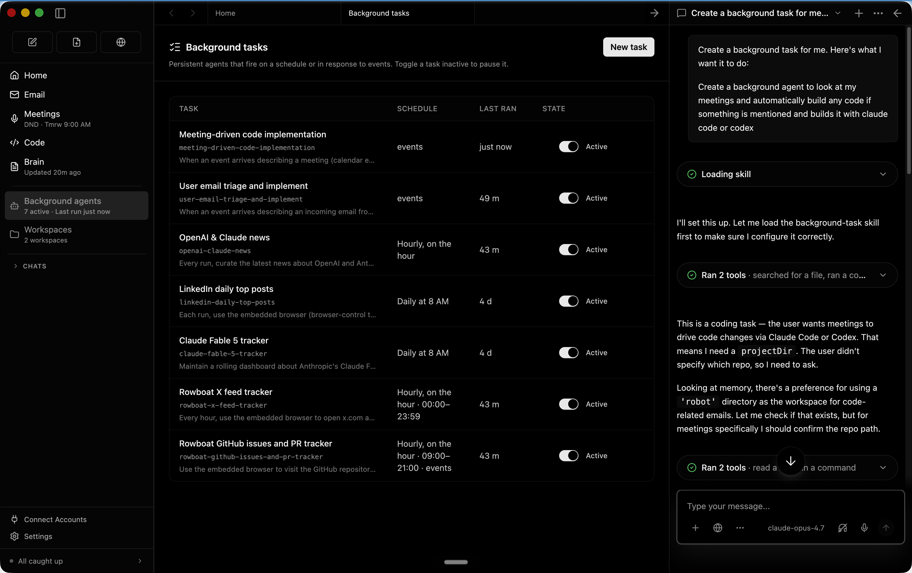
</td>
</tr>
<tr>
<td width="40%" valign="middle">
<h3>Built-in Browser</h3>
Rowboat includes a browser that lets you and assistant collaborate on web tasks. Because it's isolated from your main browser, you can log in only to the accounts that you want the assistant to access.
</td>
<td width="60%">
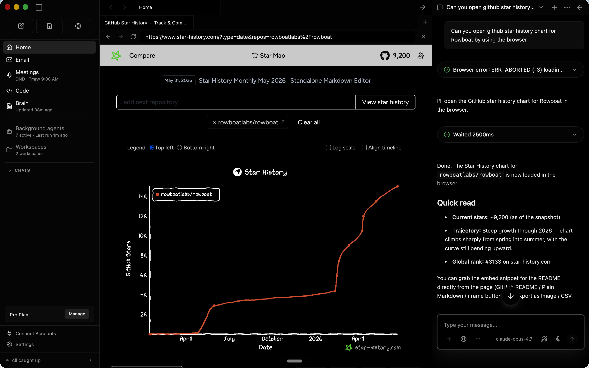
</td>
</tr>
<tr>
<td width="40%" valign="middle">
<h3>Meeting Notes</h3>
A local meeting note-taker that taps into mic & speaker, produces live transcript and summarizes the meeting in a markdown file and updates the knowledge graph.
</td>
<td width="60%">
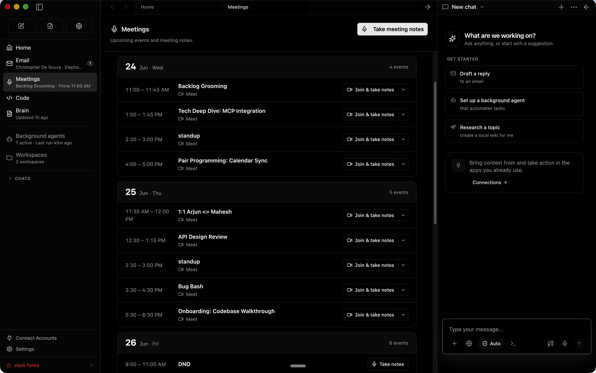
</td>
</tr>
<tr>
<td width="40%" valign="middle">
<h3>Code Mode</h3>
Code mode lets you spin up parallel coding agents with Claude Code or Codex, and have Rowboat drive them with all the work context where needed.
</td>
<td width="60%">

</td>
</tr>
<tr>
<td width="40%" valign="middle">
<h3>Apps</h3>
You can build your own work surfaces inside Rowboat. They get access to all the tools and integrations, and you can share them with other people.
</td>
<td width="60%">
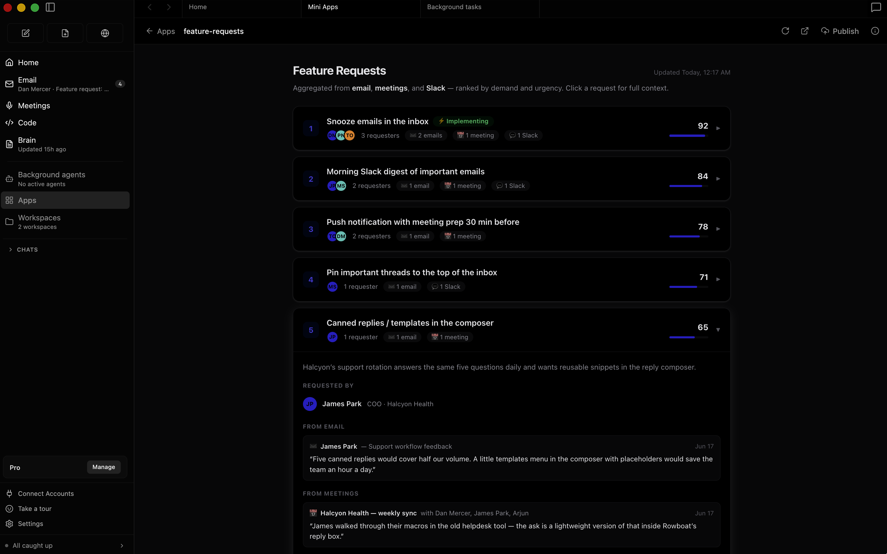
</td>
</tr>
<tr>
<td width="40%" valign="middle">
<h3>Integrations</h3>
Includes one-click integrations to most popular products.
</td>
<td width="60%">

</td>
</tr>

</table>

<p align="center">
  <a href="https://www.youtube.com/watch?v=et5yQABJ3xI">Demo: apps to code</a> · <a href="https://www.youtube.com/watch?v=7xTpciZCfpw">Demo: knowledge graph</a>
</p>

---

## Installation

**Download latest for Mac/Windows/Linux:** [Download](https://www.rowboatlabs.com/downloads)

**All release files:**   https://github.com/rowboatlabs/rowboat/releases/latest

### Google setup
To connect Google services (Gmail, Calendar, and Drive), follow [Google setup](https://github.com/rowboatlabs/rowboat/blob/main/google-setup.md).

### Voice input
To enable voice input and voice notes (optional), add a Deepgram API key in `~/.rowboat/config/deepgram.json`

### Voice output

To enable voice output (optional), add an ElevenLabs API key in `~/.rowboat/config/elevenlabs.json`

### Web search

To use Exa research search (optional), add the Exa API key in `~/.rowboat/config/exa-search.json`

### External tools

To enable external tools (optional), you can add any MCP server or use Composio tools by adding an API key in `~/.rowboat/config/composio.json`

All API key files use the same format:
```
{
  "apiKey": "<key>"
}
```

---

## Run your own Harbor

Harbor is the Spaces server. It is open source, in this repo at [`apps/harbor`](apps/harbor), and it is what Rowboat's hosted servers run. One process serves one org or many, on top of Postgres.

**Try it locally in a minute.** The dev entry boots a seeded single-org Harbor (a small team and a "Roadboard" space) in memory on port 4272, with dev tokens instead of real sign-in:

```bash
cd apps/harbor
pnpm install && pnpm build
cd packages/server && pnpm dev
```

In the app, open the Spaces dialog, choose *Add a dev server*, and point it at `http://localhost:4272` with one of the seeded member ids. Or talk to it directly: every route in `/v1/*`, the live stream at `/v1/live`, and the agent door at `/mcp`. Set `DATABASE_URL` to make it durable.

**Deploy it for a team.** The [Dockerfile](apps/harbor/Dockerfile) builds the deployment image. Orgs are served by hostname under your apex domain (`<slug>.<APEX_DOMAIN>`), sign-in is OpenID Connect against an issuer you pin, and new members only ever arrive by accepting an invite.

| Variable | What it does |
|---|---|
| `HARBOR_MODE=deployment` | Multi-org mode: resolve the org from the request host. |
| `DATABASE_URL` | Postgres. Schema is a versioned, append-only migration ladder. |
| `APEX_DOMAIN` | Orgs live at `<slug>.<APEX_DOMAIN>`; the apex itself serves create-org and my-orgs. |
| `AUTH_ISSUER` | The OIDC issuer whose tokens are trusted (JWKS-verified). Without it Harbor falls back to dev tokens, which must never be exposed publicly. |
| `AUTH_PUBLISHABLE_KEY` | Enables the login/consent page (social sign-in only; Harbor never sees a credential). |
| `HARBOR_ALLOWED_DOMAINS` | Comma-separated email domains allowed to accept invites (single-org mode). |
| `BLOBS_DIR` or `BLOBS_S3_BUCKET` | Where uploads go: local disk, or any S3-compatible bucket (`BLOBS_S3_ENDPOINT`, `BLOBS_S3_REGION`). |
| `PORT` | Defaults to 4272. |

The wire contract between Harbor and everything that talks to it is the `@rowboat/spaces-protocol` package; [`apps/harbor/CONTRACT.md`](apps/harbor/CONTRACT.md) is its narrative, including the merge semantics, the invite ceremony, and what is deliberately still v0. Expect breaking changes while we dogfood.

## Bring any agent to a Space

Every org exposes an MCP server at `https://<org address>/mcp` (streamable HTTP). It is the exact surface Rowboat's own agent uses: read and post messages, react, open DMs, create and manage threads, read files, propose changes with a base version, upload attachments, search, catch up on activity, mint invites. Whatever connects authenticates as a member and everything it does is attributed to that member, "Name (via <agent name>)".

With Claude Code, for example:

```bash
claude mcp add --transport http my-team https://<org address>/mcp
```

Harbor publishes OAuth protected-resource metadata, so any MCP client that speaks OAuth 2.1 finds the sign-in flow on its own. Sign in as yourself and the agent works as you; sign in as a member you created for it and it has a seat of its own.

---

## How it's different

Most AI tools reconstruct context on demand by searching transcripts or documents, and most team AI tools put one shared bot in the middle of everyone's data.

Rowboat keeps **long-lived, personal knowledge** and makes the **sharing explicit**:
- context accumulates over time, on your machine, as plain Markdown you can edit
- relationships are explicit and inspectable
- each teammate's agent is their own: their memory, their tools, their model keys
- a Space holds only what people and their agents chose to post to it

The result is memory that compounds, and collaboration that does not require handing your inbox to a shared bot.

## Bring your own model

Rowboat works with the model setup you prefer:
- **Local models** via Ollama or LM Studio
- **Hosted models** (bring your own API key/provider)
- Swap models anytime. Your data stays in your local Markdown vault, and your teammates never need to share your keys.

## Extend Rowboat with tools (MCP)

Rowboat can connect to external tools and services via **Model Context Protocol (MCP)**.
That means you can plug in (for example) search, databases, CRMs, support tools, and automations - or your own internal tools.

Examples: Exa (web search), Twitter/X, ElevenLabs (voice), Slack, Linear/Jira, GitHub, and more.

### Example: Parallel web search

[Parallel Search MCP](https://docs.parallel.ai/integrations/mcp/search-mcp) provides `web_search` and `web_fetch` for public web search and page extraction without a Parallel account or API key. Free access is rate limited.

Open **Settings → MCP Servers**, add the `parallel` entry to your existing `mcpServers` object, and click **Save**. Keep any other server entries. If no servers are configured, use:

```json
{
  "mcpServers": {
    "parallel": {
      "url": "https://search.parallel.ai/mcp"
    }
  }
}
```

This connects through Rowboat's existing Streamable HTTP client. Ask Rowboat to list the tools on the `parallel` server, then try: "Use Parallel to find the official MCP documentation."

Once configured, Rowboat can invoke these tools during its work, subject to your MCP tool permissions. Queries, requested URLs, and any supplied objectives or context are sent to Parallel. This setup leaves Exa and other configured providers unchanged. To remove it, delete the `parallel` entry in **Settings → MCP Servers** and save.

## Local-first by design

- All personal data is stored locally as plain Markdown
- No proprietary formats or hosted lock-in: the Space server is open source and self-hostable too
- You can inspect, edit, back up, or delete everything at any time

## What's in this repo

- [`apps/x`](apps/x): the desktop app (Electron), the headless `rowboat-server`, and a Spaces-only mobile client
- [`apps/harbor`](apps/harbor): the Spaces server and the `@rowboat/spaces-protocol` contract

---

<p align="center">
  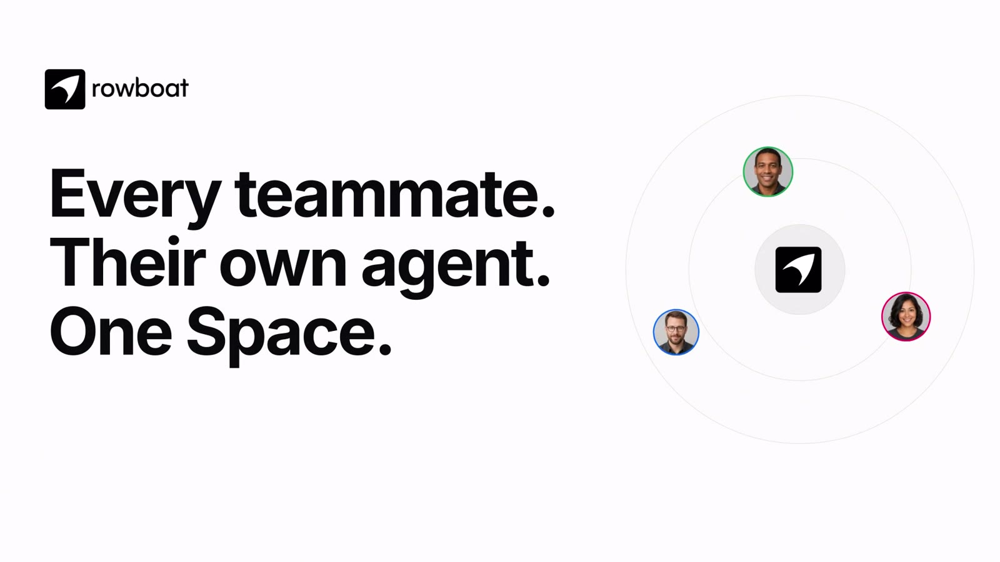
</p>

<div align="center">

[Discord](https://discord.gg/wajrgmJQ6b) · [Twitter](https://x.com/intent/user?screen_name=rowboatlabshq)
</div>
