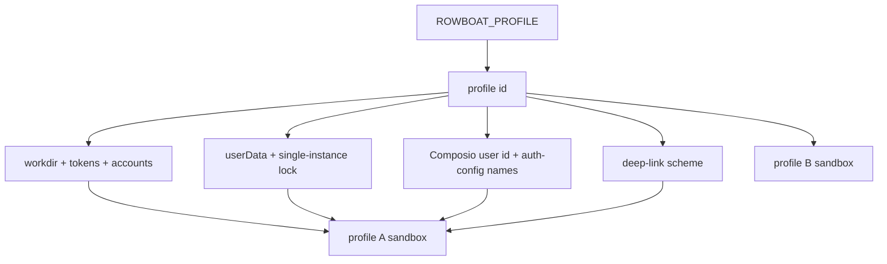
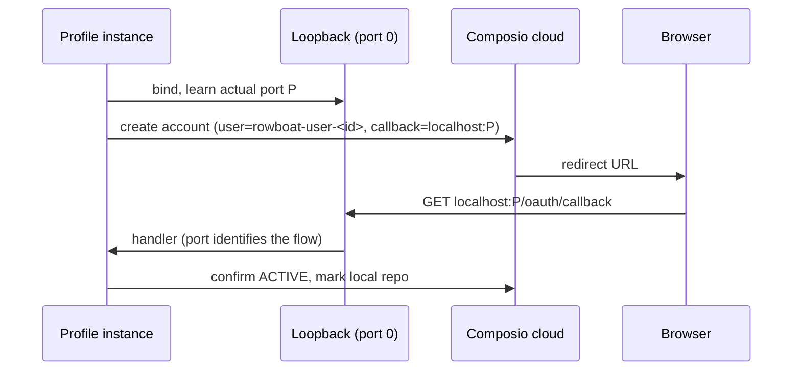

# First-Party Rowboat Profiles - Plan

## Goal Capsule

- **Objective:** Two Rowboat desktop instances (Work and Personal) run side by side with fully separate identity — connections made on one never appear on, steal callbacks from, or get misdelivered to the other — shipped as an upstream pull request.
- **Means:** Env-selected profile (`ROWBOAT_PROFILE`) namespacing workdir, Electron userData, Composio identity, callback ports, and deep-link schemes (KTD1).
- **Authority:** Session-settled decisions below override inference; Key Decisions own product scope; KTDs own mechanism.
- **Stop conditions:** A session-settled decision proves infeasible on evidence (return `settled-decision-invalidated`); or the fork/push path proves unavailable (report blocked with recovery).
- **Who finishes:** `ce-work` executes units U1–U6; LFG ships the PR.

## Product Contract

### Summary

This plan ships first-party profiles for the Rowboat desktop app so Work and Personal instances are fully separate, with default behavior byte-identical, verified by unit tests plus a two-instance live check and delivered as an upstream PR.

### Problem Frame

Two Rowboat instances on one machine share one Composio identity (`rowboat-user`), one fixed OAuth callback port (8081), and one `rowboat://` deep-link scheme. In live use this caused one profile to consume the other's OAuth completion (a generic third instance claimed a Google login), stuck Connections UI, and cross-profile connection leakage. Launcher scripts and protocol routers work around the symptoms from outside; only the app itself can separate the identity.

### Requirements

#### Identity separation

- R1. A `ROWBOAT_PROFILE` env var selects the profile; unset or blank means `default`, which preserves current behavior exactly.
- R2. Invalid profile ids are rejected with a clear error; ids are limited to 1–32 lowercase letters, digits, or dashes.
- R3. A named profile resolves an isolated workdir under `~/.rowboat-profiles/<id>`; `default` keeps `~/.rowboat`, and an explicit `ROWBOAT_WORKDIR` still wins for the directory.
- R4. Composio identity is namespaced per profile (user id and managed-auth config names); `default` keeps the historic values so existing connected accounts keep working.

#### Callback routing

- R5. Composio OAuth binds a dynamic loopback port per flow and registers the actually-bound URL as the callback; no fixed port is shared between profiles.
- R6. The loopback binder reports the real bound port (including the IPv6 twin), so dynamic-port callers route home.

#### Deep-link routing

- R7. Non-default profiles register both `rowboat://` and `rowboat-<profile>://`; dispatch accepts both.
- R8. Links the app generates itself use the owning profile's scheme, and every in-app consumer accepts profile schemes.

#### Compatibility and shipment

- R9. Default-profile behavior is byte-identical: same dirs, ids, scheme, and configured ports as today, excluding ephemeral per-flow loopback ports, which are an internal detail.
- R10. The change ships as an upstream PR with lint, tests, typecheck, and the Electron package smoke green, with known limitations documented in the PR body.

### Key Decisions

- **Work and Personal instances are fully separate, with no shared identity.** (session-settled: user-directed — chosen over external launcher/router workarounds sharing one identity: shared identity caused cross-profile OAuth theft and stuck Connections UI). Governs R3, R4, R5, R7.
- **Ship as an upstream first-party change, not local machine scripts.** (session-settled: user-directed — chosen over patching the local prebuilt binary: binary patching is fragile and unshippable). Governs R10.

### Success Criteria

- An upstream PR is open against `rowboatlabs/rowboat` from the operator's fork, with all CI gates green.
- Two concurrent instances (default + named profile) each complete a Composio toolkit connect against different accounts, with no shared user id, port, or scheme delivery.
- A reviewer can verify default behavior is unchanged from the plan's verification matrix alone.

### Scope Boundaries

- In scope: profile resolution and identity derivation, Composio flows, loopback binder, Electron main process (userData, lock, schemes, link producers/consumers), renderer link parsers, per-profile Apps-server port, tests, PR mechanics.
- Deferred to Follow-Up Work: in-app profile-switcher UI; ChatGPT fixed callback port (pre-registered, fails fast today); Google BYOK fixed-port flows; cloud Spaces identity; installer-declared per-profile schemes; local launcher scripts and the prebuilt-binary patch.

---

## Planning Contract

### Key Technical Decisions

- KTD1. Per-profile identity derives from one module: workdir, Composio user id, auth-config names, and deep-link scheme each have a pure function of the profile id, with `default` returning historic values. (session-settled: user-directed — chosen over shared identity with external routing: cross-profile auth theft). Governs R1, R2, R3, R4, R9.
- KTD2. Profile selection is env-only (`ROWBOAT_PROFILE`); no CLI flag. Import hoisting makes argv unreliable at config-evaluation time, and env matches the existing `ROWBOAT_*` precedent launchers already export.
- KTD3. Composio flows bind port 0 first and register the bound URL, following the `oauth-flows.ts` dynamic-port precedent; pre-registered flows (ChatGPT, BYOK) stay fixed and are documented limitations.
- KTD4. `userData` is set before `requestSingleInstanceLock`, because the lock is keyed on the userData path; default keeps the historic location so no migration occurs.
- KTD5. Auth-config lookup matches by per-profile name before falling back to create; this needs the config name exposed on the account type.
- KTD6. The Apps-server default port is deterministic per profile: 3210 for `default`, otherwise 3210 plus 1 plus a stable hash of the id modulo 199 (ports 3211–3409), logged at boot; the existing override env var still wins for single-instance use.
- KTD7. Locally generated links use the profile-scheme builder, and all in-app consumers (main, renderer, notifications) accept profile schemes; the legacy scheme keeps working for default.
- KTD8. A `ROWBOAT_WORKDIR` override changes the directory but never the identity, and an explicit override that diverges from the derived dir for a named profile refuses to start with a clear error, so two live instances can never share one Composio identity through configuration alone.

### High-Level Technical Design

Two profiles must never share an identity token, a callback socket, or a URL mailbox. The design gives each profile its own of all three, derived from one id.

A Composio connect binds its own port first, then tells the provider where to call back, so two simultaneous connects cannot intercept each other.

Profile id and workdir override combine in four ways; only the documented corners are unsupported.

| Profile id | Workdir override | Identity follows | Verdict |
|---|---|---|---|
| default | none | historic shared values | Supported, unchanged |
| named | none | profile id | Supported |
| any | set | profile id (dir differs) | Supported, documented |
| same id | two dirs | startup refuses with a clear error |

### Assumptions

- The fork `duketopceo/rowboat` accepts pushes and can PR `upstream/main`; push denial stops as blocked with the recovery path.
- The in-tree implementation is substantially correct; units verify and complete it rather than rewriting.
- No in-app switcher in this shipment; env selection plus external launchers are the launch path, with UI as follow-up.
- The rowboat-mode Google return path is webapp-side and out of repo reach; the shipment documents the race and refuses foreign tickets loudly instead of fixing routing.
- CI gates are those observed in `x-tests.yml` (harbor build, lint, test, typecheck, package smoke).

---

## Implementation Units

### U1. Profile module and workdir wiring

**Goal:** The profile id resolves, validates, and derives every identity token, with the workdir following it.
**Requirements:** R1, R2, R3, R4 (identity derivation only), R9. Governs KTD1.
**Dependencies:** None.
**Files:**
- `apps/x/packages/core/src/config/profile.ts` (verify/complete)
- `apps/x/packages/core/src/config/profile.test.ts` (extend)
- `apps/x/packages/core/src/config/config.ts` (verify)

**Approach:**
- Keep resolution pure and env-injectable for tests; module-level constant reads live env once.
- Workdir override keeps precedence; identity always follows the id per KTD8.

**Test scenarios:**
- Blank, unset, and whitespace-only env resolve to `default`.
- Mixed-case and padded ids normalize; path-unsafe ids (`../`, slashes, over-length) throw with a clear message.
- Default derivations equal historic values (dir, user id, config name, scheme).
- Named derivations are namespaced and pairwise distinct across three ids.
- Deep-link builder strips a leading slash and prefixes the profile scheme.

**Verification:** New and existing colocated vitest cases pass; no other module imports change.

### U2. Loopback bound-port reporting

**Goal:** Dynamic-port callers learn the real port, on both loopback families.
**Requirements:** R6. Governs KTD3.
**Dependencies:** None.
**Files:**
- `apps/x/packages/core/src/auth/loopback-server.ts` (verify)
- `apps/x/packages/core/src/auth/loopback-server.test.ts` (extend)

**Approach:**
- Resolve the bound port from the listening socket and twin-bind the same port; keep fixed-port callers byte-identical.

**Test scenarios:**
- Two concurrent port-0 binds return distinct nonzero ports.
- A callback fetch to each port reaches only its own handler.
- The existing fixed-port relay test still passes unchanged.
- Closing one flow leaves the other functional.

**Verification:** Concurrency test plus existing relay test green.

### U3. Composio flows: dynamic ports, identity, config matching

**Goal:** Concurrent connects across profiles never share a port, user, or config.
**Requirements:** R4, R5. Governs KTD3, KTD5.
**Dependencies:** U1, U2.
**Files:**
- `apps/x/packages/core/src/composio/flows.ts` (complete)
- `apps/x/packages/core/src/composio/types.ts` (expose config name)
- `apps/x/packages/core/src/runtime/tools/domains/composio.ts` (verify)
- `apps/x/packages/core/src/apps/host-api.ts` (verify)

**Approach:**
- Bind first, register the bound URL, fill the account id into the handler cell before any browser tab can return.
- Expose the config display name on the account type, then match exact per-profile name plus managed plus OAUTH2 across all list pages before falling back to create; never fall back to a foreign-named managed config.
- Bind the callback handler to the flow with a state gate matching the existing gatekeeper precedent: a hit carrying unknown state renders the polite error page and never syncs status.
- Close the bound server on every failure path (account creation, missing redirect URL, timeout).
- Execution note: extract the config-matching selection into a pure helper and prove it test-first.

**Test scenarios:**
- Pure selector returns the per-profile config when present among shared ones.
- Pure selector falls back to create-signal when only foreign configs exist.
- Flow failure after bind closes the server (no leaked listener).
- Missing redirect URL closes the server and reports failure.
- All `user_id` call sites resolve through the helper; a repo-wide search finds no hardcoded shared id outside the default branch.

**Verification:** New selector unit tests green; full-suite run shows no other failures; manual two-profile connect succeeds with distinct account ids.

### U4. Main process: lock partition and dual schemes

**Goal:** Each profile owns its lock and its URL mailbox.
**Requirements:** R7, R9. Governs KTD4.
**Dependencies:** U1.
**Files:**
- `apps/x/apps/main/src/main.ts` (verify)
- `apps/x/apps/main/src/deeplink.ts` (verify)

**Approach:**
- Set userData before the lock call; register legacy plus profile schemes for non-default profiles; accept both on every parse site.
- Refuse foreign tickets loudly: the completion handler checks the session state against this profile's pending flows first; unknown state renders the polite error page, writes nothing, focuses nothing, and logs the refusal observably.

**Test scenarios:**
- Default registers exactly one scheme; named registers two.
- Each parse site accepts legacy and profile URLs and rejects foreign schemes.
- Second launch of the same packaged profile exits silently; second-instance argv still dispatches.
- A cross-profile deep-link delivery attempt is refused observably: no token write, no focus steal, refusal in the log.
- Execution note: no unit harness exists for main; prove via typecheck, package smoke, and the live dual-instance check.

**Verification:** Main typecheck clean; package smoke passes; two profiles run concurrently with distinct locks.

### U5. Link producers, consumers, and Apps-server port

**Goal:** Links generated and consumed in-app stay inside their profile; the second instance's servers all bind.
**Requirements:** R7, R8. Governs KTD6, KTD7.
**Dependencies:** U1, U4.
**Files:**
- Producers: `apps/x/apps/main/src/menu.ts`, `apps/x/apps/main/src/ipc.ts`, `apps/x/apps/main/src/main.ts` (org-link site), `apps/x/packages/core/src/spaces/links.ts`, `apps/x/packages/core/src/runtime/tools/domains/notifications.ts`, `apps/x/packages/core/src/todo/runner.ts`, `apps/x/packages/core/src/runtime/legacy/engine.ts`, `apps/x/packages/core/src/knowledge/notify_calendar_meetings.ts`, `apps/x/packages/core/src/knowledge/email/store.ts` (verify)
- Consumers: `apps/x/apps/renderer/src/App.tsx`, `apps/x/apps/renderer/src/lib/spaces-navigation.ts`, `apps/x/apps/main/src/notification/electron-notification-service.ts` (widen)
- `apps/x/packages/core/src/apps/constants.ts` or owning site (per-profile port default)
- `apps/x/apps/renderer/src/lib/spaces-navigation.test.ts` (extend)

**Approach:**
- Build local links with the profile-scheme builder; widen consumers to accept profile schemes with a shared pattern; the renderer learns its own scheme from the existing app-config IPC response, never by importing core constants.
- Derive the Apps-server default port per KTD6; the existing override still wins.

**Test scenarios:**
- A profile-scheme notification link dispatches instead of falling through to window focus.
- Renderer link parsers accept legacy and profile schemes and still reject foreign input (extend the existing navigation test).
- Two profiles start with no bind conflict on the Apps port when no override is set.
- Explicit override env var still wins over the derived default.

**Verification:** Renderer suite green; live dual-instance start shows distinct ports and working notification links.

### U6. Release notes, limitations, and gate validation

**Goal:** The PR is reviewable, honest about boundaries, and green.
**Requirements:** R10.
**Dependencies:** U1, U2, U3, U4, U5.
**Files:** PR body (not a repo file); limitation notes live there, not in code.

**Approach:**
- Document ChatGPT and BYOK fixed-port limits, installer scheme declaration, the webapp return-path race, and the workdir-identity matrix.
- Run the full gate sequence in dependency order before pushing.

**Test scenarios:**
- Test expectation: none -- this unit ships process output, verified by gate results, not by unit tests.

**Verification:** Lint, shared/core/server/renderer tests, typecheck, Harbor build, and the Electron package smoke all pass; PR body contains the limitations section and `ROWBOAT_PROFILE` launch examples.

---

## Verification Contract

| Gate | Command context | Signal |
|---|---|---|
| Harbor build | `apps/harbor` | `pnpm install --frozen-lockfile`, `pnpm -r build` succeeds |
| Lint | `apps/x` | `npm run lint` clean on main and packages |
| Unit tests | `apps/x` | `npm test` green except the two pre-existing failures recorded before this work |
| Typecheck | `apps/x` | `npm run typecheck` introduces no new errors |
| Package smoke | `apps/x/apps/main` | `npm run package` passes with code signing skipped |
| Live separation | two profiles | Distinct Composio account ids, ports, and scheme delivery with both running |

## Definition of Done

- All six units complete per their verification; abandoned-attempt code removed from the diff.
- The diff touches only profile-scope files; unrelated branch work stays out.
- An upstream PR is open from the fork with limitations documented; CI green per Success Criteria.
- No inbox change to default-profile users: dirs, ids, scheme, and ports unchanged.

---

## Appendix

- Prior verification in-session (not a substitute for the gates above): profile matrix 9/9, loopback concurrency, full core suite 988 passing with 2 pre-existing failures proven via stash, main typecheck clean, runtime smoke of built output for both profiles.
- Known pre-existing failures to exclude from regression blame: `spaces/client.test.ts` (missing module) and one `catalog.test.ts` case, both failing on pristine HEAD.
